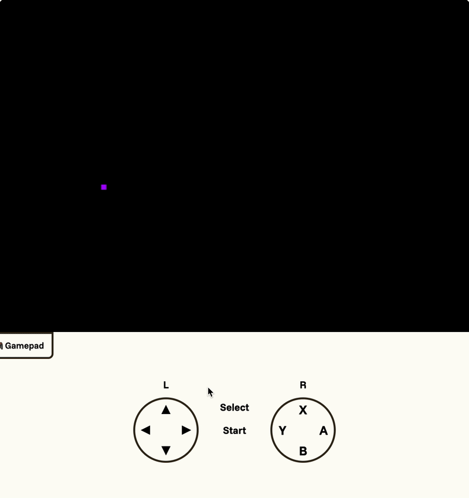
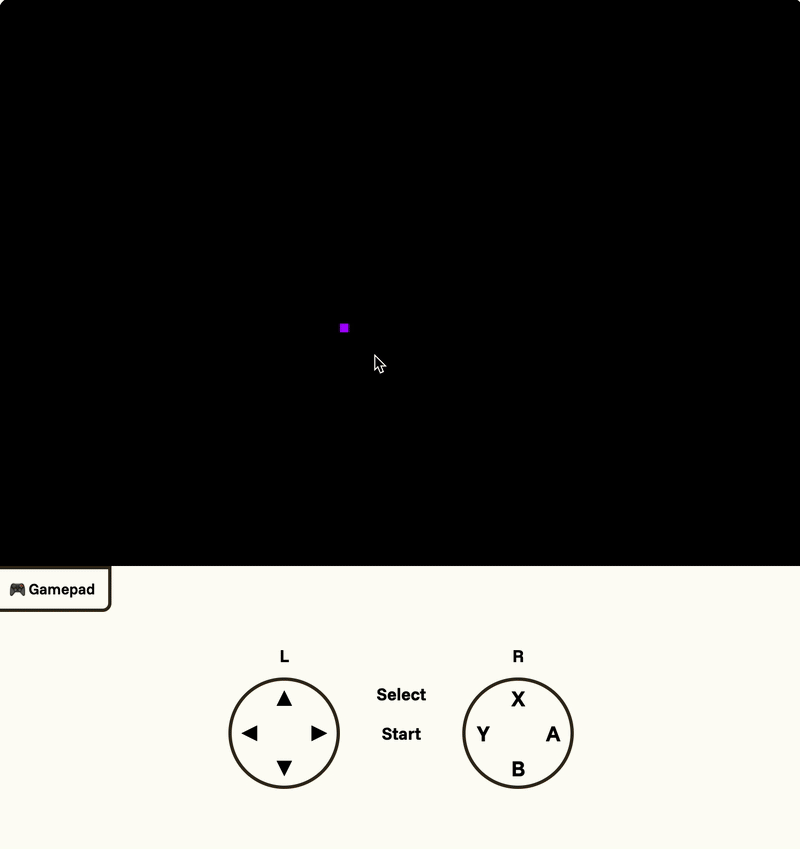

# Project Log
Created: 2025-09-01T19:52:28.273Z

### Hour 1
Date: 9/1/2025
Time range: 4:00 PM - 5:00 PM
Description: Today I started with the Flappy bird as a template. I came up with a set of modifications I could use to "convert" the Flappy bird into Nebula, starting with removing gravity. I worked on changing the code for the gamepad, so that the D pad determines the motion of the bird (ship but bird sounds cooler) instead of just making it jump (switching plane of 2D). It doesn't actually render the bird and I still don't know why. You can't see the feature I added because things are broken right now sadly, tomorrow I'll do it.

### Hour 2
Date: 9/9/2025
Time range: 8:30 AM - 9:30 AM
Description: It's been a while but today I worked on rewriting the image processing of the bird. I forgot to do that yesterday... that's why it was a static screenshot not a GIF. Now, the bird moves properly in 2D! You can see the feature I added in the github repo: .

### Hour 3
Date: 9/9/2025
Time range: 2:30 PM - 3:30 PM
Description: Added inertial movement. Took a long while to get it working... but now the ship can accelerate and experience drag and stuff. Yes there's no air resistance in space, but I didn't like the mechanic where it didn't auto slow down so... it has drag. I was recording the gif when I realized that there was a problem where the leftward drift accelerated instead of decayed (as if it was a car with no brake lines and flooring the accelerator). I realized that negative numbers are bad when unsigned ints so avoid them. You can see the feature I added in the github repo: .